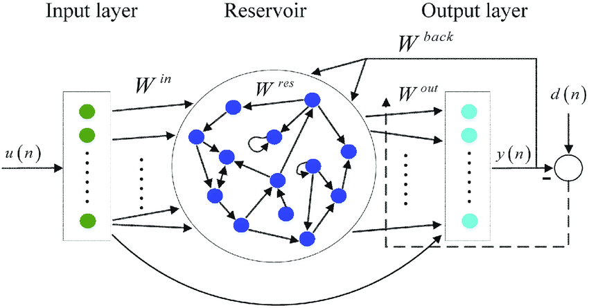

# ESN classifier with Power-efficient Photonic Systems

 


## 1. Prerequisites

#### 1.1 Dependencies

 * [Numpy](http://www.numpy.org/)
 * [Matlplotlib](http://matplotlib.org/) (for graphing)
 * [tqdm](https://github.com/tqdm/tqdm)
 * [sklearn](https://scikit-learn.org/stable/)
 * [bayes_opt](https://github.com/fmfn/BayesianOptimization)

```bash
git clone git@github.com:LonelVino/ESN_MNIST.git
cd ESN_MNIST
pip install -r requirements.txt
```

#### 1.2 Dataset

##### MNIST

- https://www.kaggle.com/oddrationale/mnist-in-csv
- http://yann.lecun.com/exdb/mnist/

#### 1.3 Test Case

[ESN MNIST (Jupyter notebook)](https://github.com/LonelVino/ESN_MNIST/blob/main/%5BESN%5DNiyamas_MNIST.ipynb)

If there are errors while running this notebook locally,  you can also refer to the notebook mounted on kaggle: [[ESN] MNIST Classification](https://www.kaggle.com/lonelvino/esn-mnist-classification-niyamas).

## 2. Introduction

[Echo State Network](http://www.scholarpedia.org/article/Echo_state_network) is easy-to-train recurrent neural networks, a variant of [Reservoir Computing](https://en.wikipedia.org/wiki/Reservoir_computing). In some sense, which aims to simplify training process, reduce computation and overcome fading memory problem of RNN. In this project, the system model is designed as follow:

### (1) System Equation

##### **(1.1) Hidden Layer**


where **x**(*k*) is the *N*-dimensional reservoir state, *f* is a sigmoid function (usually the logistic sigmoid or the tanh function),  is the *N*×*N* reservoir weight matrix,  is the *N*×*P* input weight matrix, **u**(*k*) is the *P* dimensional input signal,  is the *N*×*M* output feedback matrix, and **y**(*k*) is the *M*-dimensional output signal.

> - , ,  are generated randomly and fixed. 
> - In this task, the output feedback isn’t required, thus  is nulled. 

##### **(1.2) Output (Readout) Layer**

The extended system state <u>**z**(*k*)=[**x**(*k*);**u**(*k*)]</u> at time *k* is the concatenation of the reservoir and input states. The output is obtained from the extended system state by:


where  is the output activation functions (typically linear or a sigmoid) and  is a *M*×(*P*+*N*)-dimensional matrix of output weights.

### (2) Learning Equation

The desired output weights  are the linear regression weights of the desired output **d** *(k)* on the harvested extended states **z** *(k)*, which is called as readout weights, the only learnable parameters of the reservoir computer architecture in this project: 


which is an offline algorithm. Here,  is the target matrix containing the  targets values for the *m* outputs of the reservoir computer, when inputs vectors are fed to the reservoir during  time steps. 




## 3.Reference

[1] “(PDF) An overview of reservoir computing: Theory, applications and implementations.” https://www.researchgate.net/publication/221166209_An_overview_of_reservoir_computing_Theory_applications_and_implementations (accessed Feb. 02, 2022).

[2] R. J. Williams and D. Zipser, “A Learning Algorithm for Continually Running Fully Recurrent Neural Networks,” *Neural Computation*, vol. 1, no. 2, pp. 270–280, Jun. 1989, doi: [10.1162/neco.1989.1.2.270](https://doi.org/10.1162/neco.1989.1.2.270).

[3] A. Lamb, A. Goyal, Y. Zhang, S. Zhang, A. Courville, and Y. Bengio, “Professor Forcing: A New Algorithm for Training Recurrent Networks,” *arXiv:1610.09038 [cs, stat]*, Oct. 2016, Accessed: Feb. 04, 2022. [Online]. Available: http://arxiv.org/abs/1610.09038

[4] H. Jaeger, “The" echo state" approach to analysing and training recurrent neural networks-with an erratum note’,” *Bonn, Germany: German National Research Center for Information Technology GMD Technical Report*, vol. 148, Jan. 2001.